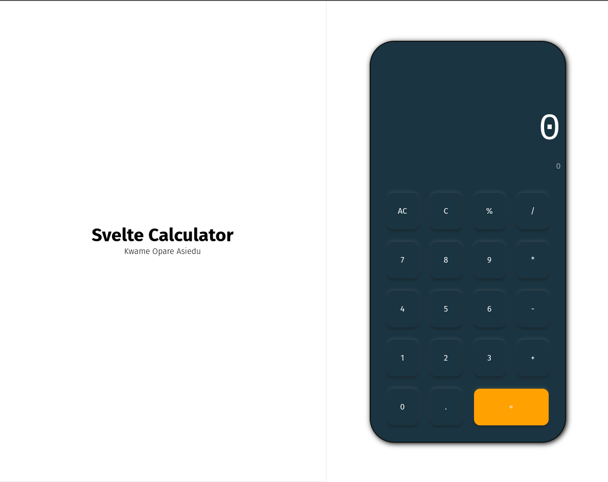

# Svelte Calculator
A simple beautiful calculator built using Svelte as a learning experience. 

[**Click here to preview the application**](https://kwameopareasiedu.github.io/svelte-calculator/)

## Running the project
1. Clone the project
2. `cd` into project folder
3. Run `yarn install` to install dependencies
4. Run `yarn dev` to start the dev server
5. Open `localhost:8000` to preview app
